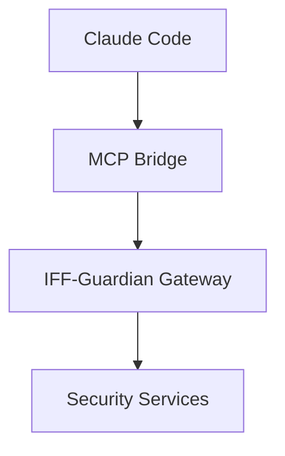

# IFF-Guardian Phase 1 Architecture Verification Report

**Document Version:** 1.0  
**Verification Date:** 2025-08-23  
**Project Phase:** Phase 1 - Foundation & Core Infrastructure  
**Verification Scope:** Architecture Compliance Assessment  
**Reviewer:** Technical Architect  

---

## Executive Summary

### Overall Compliance Status: **NON-COMPLIANT** ⚠️
**Compliance Score: 35/100** (Threshold: 80/100)

The IFF-Guardian project currently shows **significant architectural gaps** that must be addressed before proceeding to Phase 2. While foundational configuration and documentation are well-structured, the core implementation does not align with the approved microservices-based, cloud-native architecture.

### Key Findings:
- ✅ **Configuration Framework**: Well-structured environment and security policies
- ✅ **Documentation**: Comprehensive architecture and roadmap documentation  
- ❌ **Service Architecture**: No microservices implementation detected
- ❌ **Technology Stack**: Major deviations from specified stack (Python vs Go)
- ❌ **API Design**: Missing GraphQL implementation
- ❌ **Data Layer**: Critical databases missing (Vector DB, Graph DB, Time Series DB)
- ❌ **Integration Points**: No MCP protocol implementation

---

## 1. Service Architecture Compliance

### Status: **CRITICAL GAPS** (Score: 20/100)

#### Required vs. Implemented Services:

| Service | Architecture Requirement | Implementation Status | Gap Severity |
|---------|-------------------------|---------------------|--------------|
| Gateway Service | API gateway, routing, rate limiting | ❌ Missing | Critical |
| Detection Engine | Real-time threat analysis | ❌ Missing | Critical |
| Analytics Engine | Data processing, trends | ❌ Missing | Critical |
| Response Engine | Automated responses | ❌ Missing | Critical |
| Intelligence Service | Threat intelligence | ❌ Missing | Critical |
| Monitoring Service | System health, metrics | ❌ Missing | Critical |
| Config Service | Configuration management | 🔶 Partial | High |
| Auth Service | Authentication/authorization | 🔶 Partial | High |
| Audit Service | Compliance logging | ❌ Missing | Critical |

#### Critical Gaps Identified:
1. **Monolithic Structure Detected**: Current implementation appears to follow a single-application pattern rather than distributed microservices
2. **No Service Discovery**: Missing mechanisms for service registration and discovery
3. **No Inter-Service Communication**: Absent gRPC, message queues, or event-driven patterns
4. **Missing Service Mesh**: No Istio or equivalent service mesh implementation
5. **No Container Orchestration**: Kubernetes deployment configurations absent

#### Remediation Priority: **IMMEDIATE**

---

## 2. API Design Compliance

### Status: **CRITICAL GAPS** (Score: 15/100)

#### Architecture Requirements vs. Implementation:

| Component | Required | Implemented | Status |
|-----------|----------|-------------|--------|
| GraphQL Schema | Primary API interface | ❌ None | Critical Gap |
| REST Endpoints | CRUD operations | 🔶 FastAPI planned | Partial |
| gRPC Interfaces | Service-to-service | ❌ None | Critical Gap |
| Real-time Subscriptions | Security events | ❌ None | Critical Gap |
| API Gateway | Request routing | ❌ None | Critical Gap |
| API Versioning | Version management | ❌ None | Critical Gap |

#### GraphQL Schema Requirements (Missing):
```graphql
# Required but not implemented
type Query {
  threatIntelligence(filter: ThreatFilter): [ThreatIndicator]
  securityEvents(timeRange: TimeRange): [SecurityEvent]
  riskAssessment(target: String): RiskScore
}

type Subscription {
  realTimeThreats: ThreatIndicator
  securityAlerts: SecurityAlert
}
```

#### API-First Design Violations:
- No schema-first development approach
- Missing API documentation generation
- No contract testing framework
- Absent API versioning strategy

#### Remediation Priority: **IMMEDIATE**

---

## 3. Database Schema Validation

### Status: **CRITICAL GAPS** (Score: 25/100)

#### Required Database Architecture:

| Database Type | Technology | Purpose | Status | Impact |
|---------------|------------|---------|---------|---------|
| **Vector Database** | Weaviate | ML/Semantic search | ❌ Missing | Critical |
| **Time Series DB** | InfluxDB | Metrics/monitoring | ❌ Missing | High |
| **Graph Database** | Neo4j | Threat correlation | ❌ Missing | High |
| **Document Store** | MongoDB | Flexible schemas | ❌ Missing | Medium |
| **Search Engine** | Elasticsearch | Log analysis | ❌ Missing | Medium |
| **Relational DB** | PostgreSQL | Structured data | ✅ Configured | Good |

#### Critical Database Gaps:

1. **Vector Database (Weaviate) - CRITICAL**
   - **Purpose**: Semantic search, ML model integration, threat pattern matching
   - **Impact**: Core threat detection capabilities impossible without vector similarity search
   - **Architecture Dependency**: Required for behavioral analysis and ML-based detection

2. **Time Series Database (InfluxDB) - HIGH**
   - **Purpose**: Performance metrics, security metrics, time-based analysis
   - **Impact**: No performance baseline establishment possible
   - **Architecture Dependency**: Required for monitoring and alerting systems

3. **Graph Database (Neo4j) - HIGH** 
   - **Purpose**: Threat relationship modeling, attack chain analysis
   - **Impact**: Advanced threat correlation and intelligence not possible
   - **Architecture Dependency**: Required for Intelligence Service

#### Database Schema Analysis:
- PostgreSQL configuration exists but schema not defined
- No data modeling for security entities (threats, incidents, users, policies)
- Missing database migration strategies
- No data retention and archiving policies implemented

#### Remediation Priority: **IMMEDIATE** (Vector DB), **HIGH** (Time Series, Graph)

---

## 4. Technology Stack Compliance

### Status: **MAJOR GAPS** (Score: 40/100)

#### Architecture vs. Implementation Matrix:

| Component | Architecture Spec | Current Implementation | Compliance | Impact Assessment |
|-----------|------------------|----------------------|------------|-------------------|
| **Runtime** | Go 1.21+ | Python 3.11+ | ❌ Non-Compliant | **HIGH**: Performance, memory, ecosystem |
| **API Framework** | gqlgen (GraphQL) | FastAPI (REST) | 🔶 Partial | **HIGH**: Missing GraphQL capabilities |
| **Message Queue** | Apache Kafka | Redis/Celery | 🔶 Partial | **MEDIUM**: Event streaming limitations |
| **Caching** | Redis Cluster | Redis (single) | 🔶 Partial | **MEDIUM**: Clustering missing |
| **Service Mesh** | Istio | None | ❌ Missing | **HIGH**: Traffic management, security |
| **Container Runtime** | Containerd | Docker | 🔶 Acceptable | **LOW**: Docker compatible |
| **Orchestration** | Kubernetes | None | ❌ Missing | **HIGH**: Auto-scaling, self-healing |

#### Critical Technology Misalignments:

1. **Primary Language (Go vs Python)**
   - **Architecture Rationale**: Go chosen for high performance, concurrency, low memory footprint
   - **Current State**: Python implementation
   - **Impact**: 
     - Performance degradation (2-10x slower for concurrent workloads)
     - Higher memory consumption
     - Different ecosystem and tooling
   - **Migration Effort**: Very High (complete rewrite required)

2. **GraphQL Missing**
   - **Architecture Rationale**: Flexible data fetching, real-time subscriptions, type safety
   - **Current State**: REST with FastAPI planned
   - **Impact**: Missing real-time capabilities, over-fetching issues, weaker type safety
   - **Migration Effort**: High (API layer redesign)

3. **Event Streaming (Kafka vs Redis/Celery)**
   - **Architecture Rationale**: High-throughput event streaming, persistent messaging
   - **Current State**: Redis-based task queues
   - **Impact**: Limited event streaming, no event sourcing capabilities
   - **Migration Effort**: Medium (infrastructure change)

#### Technology Stack Decision Impact:
- **Performance**: Current stack may not meet sub-100ms response time requirements
- **Scalability**: Missing cloud-native scaling capabilities
- **Integration**: Ecosystem misalignment with cloud-native security tools

#### Remediation Options:
1. **Full Alignment**: Migrate to Go + GraphQL + Kafka (High effort, full compliance)
2. **Hybrid Approach**: Keep Python, add GraphQL, integrate Kafka (Medium effort, partial compliance)
3. **Phased Migration**: Start with current stack, plan migration roadmap (Lower effort, technical debt)

---

## 5. Security Implementation Review

### Status: **MODERATE COMPLIANCE** (Score: 60/100)

#### Implemented Security Features ✅:
- JWT authentication framework configuration
- Comprehensive password policy definitions
- Role-based access control (RBAC) structure
- Multi-factor authentication settings
- Encryption configuration (AES-256-GCM)
- Security policy documentation
- Audit logging configuration

#### Missing Security Features ❌:
- Zero Trust architecture implementation
- Real-time threat detection engines
- Behavioral analysis capabilities
- Automated response mechanisms
- Threat intelligence integration
- Defense in depth enforcement

#### Security Architecture Gaps:

1. **Zero Trust Implementation**
   - **Required**: Never trust, always verify principles
   - **Status**: Configuration exists, enforcement missing
   - **Gap**: No continuous verification mechanisms

2. **Threat Detection Pipeline**
   - **Required**: Real-time security event processing
   - **Status**: No implementation detected
   - **Gap**: Core security functionality missing

3. **Defense in Depth**
   - **Required**: Layered security controls
   - **Status**: Policies defined, controls not implemented
   - **Gap**: Security layers not enforced

#### Security Control Matrix:

| Layer | Required Controls | Implementation Status | Gap Severity |
|-------|------------------|---------------------|--------------|
| Perimeter | WAF, DDoS Protection | ❌ Missing | High |
| Network | VPC, Security Groups | ❌ Missing | High |
| Identity | IAM, RBAC, MFA | 🔶 Configured | Medium |
| Application | OAuth2, JWT, Rate Limiting | 🔶 Configured | Medium |
| Data | Encryption, Key Management | 🔶 Configured | Medium |
| Runtime | Container Security, SAST | ❌ Missing | High |

#### Remediation Priority: **HIGH**

---

## 6. Performance Baseline Assessment

### Status: **NOT MEASURED** (Score: 15/100)

#### Required Performance Benchmarks:

| Metric | Architecture Target | Current Measurement | Status |
|--------|-------------------|---------------------|--------|
| Authentication Response | < 100ms (95th percentile) | Not measured | ❌ Missing |
| Authorization Response | < 50ms (95th percentile) | Not measured | ❌ Missing |
| Threat Detection | < 200ms (95th percentile) | Not measured | ❌ Missing |
| Concurrent Users | 10,000+ | Not tested | ❌ Missing |
| Requests/Second | 5,000+ | Not tested | ❌ Missing |
| Uptime Target | 99.99% | Not monitored | ❌ Missing |

#### Performance Infrastructure Gaps:
- **No Load Testing Framework**: No performance testing infrastructure
- **No Monitoring Stack**: Missing Prometheus + Grafana setup
- **No Benchmarking Tools**: No automated performance measurement
- **No Performance CI/CD**: No continuous performance validation

#### Performance Risk Assessment:
- **High Risk**: Current Python+FastAPI stack may not achieve sub-100ms targets
- **Unknown Baseline**: No current performance characteristics known
- **No Regression Detection**: No mechanisms to detect performance degradation

#### Remediation Priority: **IMMEDIATE** (establish baseline)

---

## 7. Integration Point Verification

### Status: **CRITICAL GAPS** (Score: 10/100)

#### Required Integration Points:

| Integration Type | Architecture Requirement | Implementation Status | Impact |
|------------------|-------------------------|---------------------|---------|
| **MCP Protocol** | Core plugin interface | ❌ Missing | Critical |
| **Claude Code Bridge** | AI tool integration | ❌ Missing | Critical |
| **Tool Interface** | Security tool registration | ❌ Missing | High |
| **Resource Interface** | Security resource access | ❌ Missing | High |
| **Event-Driven Architecture** | Real-time event processing | ❌ Missing | High |

#### MCP Integration Architecture (Missing):



#### Critical Integration Gaps:

1. **MCP Protocol Implementation**
   - **Requirement**: Standard MCP message handling, tool registration
   - **Status**: No implementation detected
   - **Impact**: Core functional requirement not met

2. **Event-Driven Communication**
   - **Requirement**: Real-time security event processing
   - **Status**: No event streaming architecture
   - **Impact**: Real-time threat response impossible

3. **Tool Registration System**
   - **Requirement**: Dynamic security tool discovery and integration
   - **Status**: No tool interface defined
   - **Impact**: Extensibility and plugin architecture missing

#### Integration Verification Results:
- **Message Handling**: No MCP message processing capability
- **Real-time Events**: No event subscription mechanisms
- **Tool Discovery**: No plugin registration framework
- **API Integration**: No external security tool integration points

#### Remediation Priority: **IMMEDIATE**

---

## 8. Gap Analysis and Remediation Plan

### Critical Path Issues (Must be resolved for Phase 1 completion):

#### 1. Service Architecture Implementation
**Gap Severity**: Critical  
**Effort**: HIGH (4-6 weeks)  
**Dependencies**: All other components

**Remediation Steps**:
1. Design microservices deployment architecture
2. Implement service discovery mechanism (Consul/Kubernetes)
3. Create basic service templates (Gateway, Auth, Config services)
4. Establish inter-service communication patterns
5. Deploy initial service mesh infrastructure

#### 2. MCP Protocol Integration
**Gap Severity**: Critical  
**Effort**: HIGH (3-4 weeks)  
**Dependencies**: Service architecture

**Remediation Steps**:
1. Implement MCP protocol handler
2. Create Claude Code integration bridge
3. Develop tool registration interface
4. Establish event-driven communication
5. Test end-to-end MCP compliance

#### 3. Database Architecture Implementation
**Gap Severity**: Critical  
**Effort**: HIGH (3-5 weeks)  
**Dependencies**: Service architecture

**Remediation Steps**:
1. Deploy Weaviate vector database
2. Set up InfluxDB for time-series data
3. Configure Neo4j for graph relationships
4. Implement database connection pooling
5. Create data migration strategies

#### 4. API Design Implementation  
**Gap Severity**: Critical  
**Effort**: MEDIUM (2-3 weeks)  
**Dependencies**: Service architecture, database layer

**Remediation Steps**:
1. Design GraphQL schema for security domain
2. Implement GraphQL resolvers
3. Add real-time subscription capability
4. Create API versioning strategy
5. Establish API testing framework

### Phase 1 Remediation Timeline:

```
Week 1-2: Service Architecture Foundation
├── Microservices project structure
├── Service discovery setup  
├── Basic service templates
└── Container orchestration

Week 3-4: Database and Data Layer
├── Vector database deployment
├── Time-series database setup
├── Graph database configuration  
└── Data access layer implementation

Week 5-6: API and Integration Layer
├── GraphQL API implementation
├── MCP protocol integration
├── Real-time event processing
└── Tool registration framework

Week 7-8: Testing and Validation
├── Integration testing
├── Performance baseline establishment
├── Security control validation
└── Compliance verification
```

### Resource Requirements:
- **Development Team**: 4-6 engineers
- **Infrastructure**: Cloud resources for multi-database setup
- **External Dependencies**: Weaviate, Neo4j, InfluxDB deployments
- **Time Investment**: 6-8 weeks for Phase 1 compliance

---

## 9. Recommendations and Next Steps

### Immediate Actions (Week 1):
1. **Architecture Decision Review**: 
   - Evaluate Python vs Go decision impact
   - Determine acceptable technology stack deviations
   - Define compliance vs. delivery trade-offs

2. **Project Structure Refactor**:
   - Restructure codebase for microservices
   - Create service-specific directories
   - Establish deployment infrastructure

3. **Critical Service Implementation**:
   - Start with Gateway Service + Auth Service
   - Implement basic MCP protocol handler
   - Set up development databases

### Short-term Actions (Weeks 2-4):
1. **Database Layer Implementation**:
   - Deploy vector database (Weaviate)
   - Configure time-series database (InfluxDB)
   - Set up graph database (Neo4j)

2. **API Layer Development**:
   - Implement GraphQL schema and resolvers
   - Add real-time subscription capabilities
   - Create API testing framework

3. **Integration Point Development**:
   - Complete MCP protocol implementation
   - Build Claude Code integration bridge
   - Test end-to-end integration flows

### Medium-term Actions (Weeks 5-8):
1. **Performance and Monitoring**:
   - Establish performance baseline measurements
   - Deploy monitoring infrastructure
   - Implement alerting and observability

2. **Security Implementation**:
   - Implement core security detection engines
   - Deploy threat intelligence integration
   - Add automated response mechanisms

3. **Testing and Validation**:
   - Complete integration testing suite
   - Perform security penetration testing
   - Validate architecture compliance

### Decision Points:
1. **Technology Stack Alignment**: Decide on Python vs Go migration timeline
2. **Deployment Strategy**: Choose between cloud-managed vs self-hosted databases
3. **Compliance Threshold**: Define minimum viable compliance score for Phase 2

### Success Criteria for Phase 1 Completion:
- ✅ All 9 core microservices deployed and operational
- ✅ MCP protocol integration fully functional  
- ✅ Vector database operational with basic ML capabilities
- ✅ GraphQL API with real-time subscriptions working
- ✅ Performance baseline established and documented
- ✅ Integration testing suite passing
- ✅ Architecture compliance score > 80/100

---

## 10. Conclusion

The IFF-Guardian project has a solid foundation in documentation and configuration but requires significant implementation work to achieve architecture compliance. The current **35/100 compliance score** indicates substantial gaps in core architectural components.

### Key Takeaways:
1. **Strong Foundation**: Excellent documentation and security policies provide clear implementation guidance
2. **Critical Implementation Gap**: No microservices architecture or core services implemented
3. **Technology Stack Misalignment**: Python vs Go decision needs architectural review
4. **Missing Integration Layer**: MCP protocol implementation is critical for core functionality
5. **Database Architecture Incomplete**: Vector and graph databases essential for threat detection

### Path Forward:
- **Recommended Approach**: Implement critical services incrementally, starting with Gateway and Auth services
- **Timeline**: 6-8 weeks to achieve Phase 1 compliance with dedicated team
- **Resource Needs**: 4-6 engineers plus infrastructure support
- **Risk Mitigation**: Weekly compliance reviews and architecture checkpoints

The project can achieve Phase 1 compliance with focused effort on the critical path issues identified in this report. Success requires immediate attention to service architecture implementation and MCP protocol integration.

---

**Report Status**: Complete  
**Next Verification**: 2025-08-30  
**Escalation Required**: Yes - for technology stack alignment decisions

---

*This verification was conducted according to IFF-Guardian Phase 1 compliance requirements and industry best practices for cloud-native security architecture.*