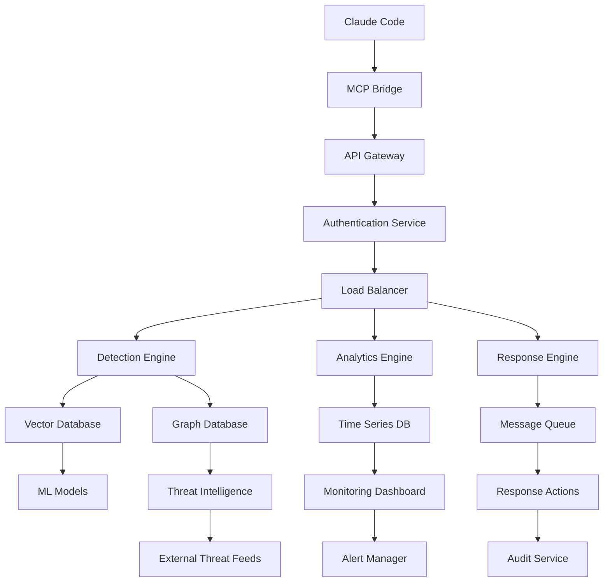

# IFF-Guardian Security MCP Plugin - High-Level Architecture

## Executive Summary

The IFF-Guardian (Identify Friend or Foe) Security MCP Plugin is a cloud-native, microservices-based security platform designed to provide comprehensive threat detection, response, and intelligence capabilities for Claude Code environments. The system employs an API-first architecture with GraphQL and Vector Database integration to deliver real-time security monitoring and automated threat mitigation.

---

## 1. System Overview and Core Components

### 1.1 System Purpose
IFF-Guardian serves as an intelligent security layer that:
- Monitors code execution and system interactions
- Provides real-time threat detection and classification
- Enables automated security response mechanisms
- Maintains security intelligence and threat databases
- Integrates seamlessly with Claude Code workflows

### 1.2 Core Components Architecture

```
┌─────────────────────────────────────────────────────────┐
│                    IFF-Guardian Platform               │
├─────────────────────────────────────────────────────────┤
│  ┌─────────────┐  ┌─────────────┐  ┌─────────────┐    │
│  │   Gateway   │  │  Analytics  │  │  Response   │    │
│  │   Service   │  │   Engine    │  │   Engine    │    │
│  └─────────────┘  └─────────────┘  └─────────────┘    │
│  ┌─────────────┐  ┌─────────────┐  ┌─────────────┐    │
│  │  Detection  │  │ Intelligence│  │ Monitoring  │    │
│  │   Engine    │  │   Service   │  │   Service   │    │
│  └─────────────┘  └─────────────┘  └─────────────┘    │
│  ┌─────────────┐  ┌─────────────┐  ┌─────────────┐    │
│  │   Config    │  │    Auth     │  │   Audit     │    │
│  │  Service    │  │   Service   │  │   Service   │    │
│  └─────────────┘  └─────────────┘  └─────────────┘    │
└─────────────────────────────────────────────────────────┘
```

### 1.3 Component Responsibilities

**Gateway Service**: API gateway, request routing, rate limiting, load balancing
**Detection Engine**: Real-time threat analysis, pattern matching, ML-based detection
**Analytics Engine**: Data processing, trend analysis, predictive modeling
**Response Engine**: Automated threat response, remediation orchestration
**Intelligence Service**: Threat intelligence aggregation, IOC management
**Monitoring Service**: System health, performance metrics, alerting
**Config Service**: Centralized configuration management, feature flags
**Auth Service**: Authentication, authorization, identity management
**Audit Service**: Compliance logging, forensic data collection

---

## 2. Technology Stack Recommendations

### 2.1 Core Services Stack

| Component | Technology | Rationale |
|-----------|------------|-----------|
| **Runtime** | Go 1.21+ | High performance, excellent concurrency, low memory footprint |
| **API Gateway** | Envoy Proxy | Industry-standard, service mesh ready, extensible |
| **GraphQL** | gqlgen (Go) | Type-safe, efficient data fetching, schema-first approach |
| **Message Queue** | Apache Kafka | High throughput, event streaming, persistent messaging |
| **Caching** | Redis Cluster | In-memory performance, clustering support, pub/sub |
| **Service Mesh** | Istio | Traffic management, security, observability |

### 2.2 Data Layer Stack

| Component | Technology | Rationale |
|-----------|------------|-----------|
| **Vector Database** | Weaviate | Semantic search, ML integration, GraphQL native |
| **Time Series DB** | InfluxDB | Optimized for metrics, high write throughput |
| **Graph Database** | Neo4j | Relationship modeling, threat correlation |
| **Document Store** | MongoDB | Flexible schema, horizontal scaling |
| **Search Engine** | Elasticsearch | Full-text search, log analysis, alerting |

### 2.3 Infrastructure Stack

| Component | Technology | Rationale |
|-----------|------------|-----------|
| **Container Runtime** | Containerd | Lightweight, CNCF standard, Kubernetes native |
| **Orchestration** | Kubernetes | Industry standard, multi-cloud, auto-scaling |
| **Service Discovery** | Consul | Service mesh integration, health checking |
| **Monitoring** | Prometheus + Grafana | Metrics collection, alerting, visualization |
| **Logging** | Fluentd + ELK Stack | Centralized logging, real-time analysis |
| **Tracing** | Jaeger | Distributed tracing, performance analysis |

---

## 3. Deployment Architecture

### 3.1 Cloud-Native Deployment Model

```
┌─────────────────────────────────────────────────────────┐
│                    Cloud Provider                      │
├─────────────────────────────────────────────────────────┤
│  ┌─────────────┐  ┌─────────────┐  ┌─────────────┐    │
│  │   Region A  │  │   Region B  │  │   Region C  │    │
│  │ (Primary)   │  │    (DR)     │  │   (Edge)    │    │
│  │             │  │             │  │             │    │
│  │ ┌─────────┐ │  │ ┌─────────┐ │  │ ┌─────────┐ │    │
│  │ │   AZ-1  │ │  │ │   AZ-1  │ │  │ │   AZ-1  │ │    │
│  │ │ ┌─────┐ │ │  │ │ ┌─────┐ │ │  │ │ ┌─────┐ │ │    │
│  │ │ │K8s  │ │ │  │ │ │K8s  │ │ │  │ │ │K8s  │ │ │    │
│  │ │ │Cluster│ │ │  │ │Cluster│ │  │ │Cluster│ │ │    │
│  │ │ └─────┘ │ │  │ │ └─────┘ │ │  │ │ └─────┘ │ │    │
│  │ └─────────┘ │  │ └─────────┘ │  │ └─────────┘ │    │
│  │ ┌─────────┐ │  │ ┌─────────┐ │  │             │    │
│  │ │   AZ-2  │ │  │ │   AZ-2  │ │  │             │    │
│  │ └─────────┘ │  │ └─────────┘ │  │             │    │
│  └─────────────┘  └─────────────┘  └─────────────┘    │
└─────────────────────────────────────────────────────────┘
```

### 3.2 Container Architecture

**Base Image Strategy:**
- Distroless base images for security
- Multi-stage builds for minimal attack surface
- Vulnerability scanning in CI/CD pipeline
- Signed container images with Sigstore/Cosign

**Resource Management:**
- Horizontal Pod Autoscaling (HPA)
- Vertical Pod Autoscaling (VPA)
- Resource quotas and limits
- Quality of Service (QoS) classes

### 3.3 Kubernetes Deployment Patterns

```yaml
# Namespace Strategy
namespaces:
  - iff-guardian-core      # Core services
  - iff-guardian-data      # Data services
  - iff-guardian-ml        # ML workloads
  - iff-guardian-monitoring # Observability
  - iff-guardian-security   # Security tools

# Service Mesh Integration
service_mesh:
  - Automatic sidecar injection
  - mTLS encryption
  - Circuit breaker patterns
  - Traffic policies
```

---

## 4. Integration Points with Claude Code

### 4.1 MCP Protocol Integration

```
┌─────────────────┐    ┌─────────────────┐    ┌─────────────────┐
│   Claude Code   │────│   MCP Bridge    │────│ IFF-Guardian    │
│                 │    │                 │    │   Gateway       │
│ ┌─────────────┐ │    │ ┌─────────────┐ │    │ ┌─────────────┐ │
│ │   Tools     │◄┼────┼►│ Tool Proxy  │◄┼────┼►│ Tool Engine │ │
│ └─────────────┘ │    │ └─────────────┘ │    │ └─────────────┘ │
│ ┌─────────────┐ │    │ ┌─────────────┐ │    │ ┌─────────────┐ │
│ │ Resources   │◄┼────┼►│ Resource    │◄┼────┼►│ Resource    │ │
│ │             │ │    │ │ Manager     │ │    │ │ Service     │ │
│ └─────────────┘ │    │ └─────────────┘ │    │ └─────────────┘ │
│ ┌─────────────┐ │    │ ┌─────────────┐ │    │ ┌─────────────┐ │
│ │ Prompts     │◄┼────┼►│ Prompt      │◄┼────┼►│ Prompt      │ │
│ │             │ │    │ │ Handler     │ │    │ │ Engine      │ │
│ └─────────────┘ │    │ └─────────────┘ │    │ └─────────────┘ │
└─────────────────┘    └─────────────────┘    └─────────────────┘
```

### 4.2 API Integration Patterns

**Tools Integration:**
```go
type SecurityTool interface {
    ValidateCode(ctx context.Context, code string) (*ValidationResult, error)
    ScanRepository(ctx context.Context, repoPath string) (*ScanResult, error)
    MonitorExecution(ctx context.Context, execID string) (*MonitoringResult, error)
    AssessRisk(ctx context.Context, assessment *RiskAssessment) (*RiskScore, error)
}
```

**Resource Integration:**
```go
type SecurityResource interface {
    GetThreatIntelligence(ctx context.Context, query *ThreatQuery) (*ThreatData, error)
    GetSecurityPolicy(ctx context.Context, policyID string) (*Policy, error)
    GetComplianceStatus(ctx context.Context, target string) (*ComplianceReport, error)
}
```

### 4.3 Event-Driven Integration

**Event Flow:**
1. Claude Code executes user command
2. MCP Bridge intercepts and enriches with security context
3. IFF-Guardian processes security events
4. Real-time threat analysis and risk scoring
5. Response actions or alerts generated
6. Feedback to Claude Code for execution control

---

## 5. Scalability and Performance Considerations

### 5.1 Horizontal Scaling Strategy

**Service-Level Scaling:**
- Stateless service design
- Auto-scaling based on CPU, memory, and custom metrics
- Load balancing with session affinity where needed
- Circuit breaker patterns for fault tolerance

**Data-Level Scaling:**
- Database sharding strategies
- Read replicas for query optimization
- Caching layers with TTL policies
- Event streaming for real-time processing

### 5.2 Performance Optimization

**Caching Strategy:**
```
┌─────────────────────────────────────────────────────────┐
│                   Caching Layers                       │
├─────────────────────────────────────────────────────────┤
│  ┌─────────────┐  ┌─────────────┐  ┌─────────────┐    │
│  │    L1       │  │     L2      │  │     L3      │    │
│  │ Application │  │  Distributed│  │  Database   │    │
│  │   Cache     │  │    Cache    │  │   Cache     │    │
│  │(In-Memory)  │  │  (Redis)    │  │ (Query)     │    │
│  └─────────────┘  └─────────────┘  └─────────────┘    │
└─────────────────────────────────────────────────────────┘
```

**Query Optimization:**
- GraphQL query complexity analysis
- Dataloader pattern for N+1 prevention
- Query result caching with cache-aside pattern
- Database index optimization

### 5.3 Resource Management

**Compute Resources:**
- CPU: Multi-core utilization with worker pools
- Memory: Efficient data structures, garbage collection tuning
- I/O: Async processing, connection pooling
- Storage: Tiered storage strategy

**Auto-Scaling Metrics:**
```yaml
autoscaling:
  cpu_threshold: 70%
  memory_threshold: 80%
  custom_metrics:
    - threat_detection_queue_depth
    - api_response_time_p95
    - active_connections
```

---

## 6. Security Architecture Layers

### 6.1 Defense in Depth Model

```
┌─────────────────────────────────────────────────────────┐
│                Security Layer Stack                    │
├─────────────────────────────────────────────────────────┤
│  ┌─────────────────────────────────────────────────┐  │
│  │           Perimeter Security                    │  │
│  │  • WAF • DDoS Protection • Geo-blocking         │  │
│  └─────────────────────────────────────────────────┘  │
│  ┌─────────────────────────────────────────────────┐  │
│  │           Network Security                      │  │
│  │  • VPC • Security Groups • Network ACLs        │  │
│  └─────────────────────────────────────────────────┘  │
│  ┌─────────────────────────────────────────────────┐  │
│  │           Identity Security                     │  │
│  │  • IAM • RBAC • MFA • Service Accounts         │  │
│  └─────────────────────────────────────────────────┘  │
│  ┌─────────────────────────────────────────────────┐  │
│  │           Application Security                  │  │
│  │  • OAuth 2.0 • JWT • API Keys • Rate Limiting  │  │
│  └─────────────────────────────────────────────────┘  │
│  ┌─────────────────────────────────────────────────┐  │
│  │           Data Security                         │  │
│  │  • Encryption at Rest • TLS • Key Management   │  │
│  └─────────────────────────────────────────────────┘  │
│  ┌─────────────────────────────────────────────────┐  │
│  │           Runtime Security                      │  │
│  │  • Container Security • SAST • DAST            │  │
│  └─────────────────────────────────────────────────┘  │
└─────────────────────────────────────────────────────────┘
```

### 6.2 Zero Trust Architecture

**Principles:**
- Never trust, always verify
- Principle of least privilege
- Assume breach mentality
- Continuous verification

**Implementation:**
```yaml
zero_trust_components:
  identity_verification:
    - Multi-factor authentication
    - Continuous authentication
    - Risk-based authentication
  
  device_security:
    - Device compliance checking
    - Certificate-based authentication
    - Device behavior analysis
  
  network_security:
    - Micro-segmentation
    - Software-defined perimeter
    - Encrypted communications
  
  data_protection:
    - Data classification
    - Dynamic data masking
    - Data loss prevention
```

### 6.3 Threat Detection Layers

**Real-time Detection:**
- Behavioral analysis
- Anomaly detection
- Signature-based detection
- Machine learning models

**Threat Intelligence Integration:**
- IOC (Indicators of Compromise) feeds
- TTPs (Tactics, Techniques, Procedures) mapping
- MITRE ATT&CK framework alignment
- Threat hunting capabilities

---

## 7. Data Flow Diagrams

### 7.1 High-Level Data Flow



### 7.2 Security Event Processing Flow

```
┌─────────────────────────────────────────────────────────┐
│                Security Event Pipeline                 │
├─────────────────────────────────────────────────────────┤
│                                                         │
│  Event Source → Ingestion → Enrichment → Analysis →    │
│                                                         │
│  Classification → Risk Scoring → Response → Audit      │
│                                                         │
└─────────────────────────────────────────────────────────┘

1. Event Ingestion:
   • Code execution events
   • API calls
   • File system operations
   • Network connections

2. Event Enrichment:
   • Threat intelligence correlation
   • Historical context
   • User behavior profiles
   • Environmental context

3. Analysis Engine:
   • Pattern matching
   • Anomaly detection
   • Machine learning inference
   • Rule-based analysis

4. Risk Assessment:
   • CVSS scoring
   • Business impact analysis
   • Confidence scoring
   • Priority classification
```

### 7.3 GraphQL Data Access Pattern

```graphql
type Query {
  threatIntelligence(filter: ThreatFilter): [ThreatIndicator]
  securityEvents(timeRange: TimeRange): [SecurityEvent]
  riskAssessment(target: String): RiskScore
  complianceStatus(framework: String): ComplianceReport
}

type Mutation {
  blockThreat(threatId: ID!): ThreatResponse
  updatePolicy(policy: PolicyInput): Policy
  initiateResponse(incident: IncidentInput): ResponseAction
}

type Subscription {
  realTimeThreats: ThreatIndicator
  securityAlerts: SecurityAlert
  systemHealth: HealthMetric
}
```

---

## 8. Component Interaction Patterns

### 8.1 Microservices Communication

**Synchronous Patterns:**
- RESTful APIs for CRUD operations
- GraphQL for complex queries
- gRPC for service-to-service communication
- Circuit breaker pattern for resilience

**Asynchronous Patterns:**
- Event-driven architecture with Kafka
- Pub/Sub for real-time notifications
- Message queues for task processing
- Event sourcing for audit trails

### 8.2 Service Interaction Matrix

```
┌─────────────┬─────────────┬─────────────┬─────────────┐
│   Service   │   Gateway   │  Detection  │ Intelligence│
├─────────────┼─────────────┼─────────────┼─────────────┤
│   Gateway   │      -      │    gRPC     │   GraphQL   │
│  Detection  │   GraphQL   │      -      │    Kafka    │
│Intelligence │    REST     │    Kafka    │      -      │
│  Analytics  │   GraphQL   │    Kafka    │    gRPC     │
│   Response  │    gRPC     │    Kafka    │   GraphQL   │
│ Monitoring  │   Metrics   │   Metrics   │   Metrics   │
└─────────────┴─────────────┴─────────────┴─────────────┘
```

### 8.3 Event-Driven Architecture Patterns

**Event Types:**
```go
type SecurityEvent struct {
    ID          string                 `json:"id"`
    Type        EventType             `json:"type"`
    Source      string                `json:"source"`
    Timestamp   time.Time             `json:"timestamp"`
    Severity    SeverityLevel         `json:"severity"`
    Data        map[string]interface{} `json:"data"`
    Metadata    EventMetadata         `json:"metadata"`
}

type EventType string
const (
    ThreatDetected    EventType = "threat.detected"
    PolicyViolation   EventType = "policy.violation"
    AnomalyDetected   EventType = "anomaly.detected"
    ResponseTriggered EventType = "response.triggered"
)
```

**Event Processing Patterns:**
- Event sourcing for complete audit trails
- CQRS (Command Query Responsibility Segregation)
- Saga pattern for distributed transactions
- Event replay for system recovery

---

## 9. Architectural Decision Records (ADRs)

### 9.1 Technology Choice Rationales

**Go as Primary Language:**
- **Decision:** Use Go 1.21+ for all core services
- **Rationale:** 
  - Excellent concurrency support for security workloads
  - Low memory footprint for containerized deployments
  - Strong ecosystem for cloud-native development
  - Built-in security features and static analysis tools

**GraphQL for API Layer:**
- **Decision:** Implement GraphQL as primary API interface
- **Rationale:**
  - Flexible data fetching reduces over-fetching
  - Strong typing system improves API reliability
  - Real-time subscriptions for security events
  - Better integration with modern frontend frameworks

**Weaviate as Vector Database:**
- **Decision:** Use Weaviate for semantic search and ML operations
- **Rationale:**
  - Native GraphQL support
  - Built-in ML model integration
  - Excellent performance for similarity searches
  - Strong community and enterprise support

**Kubernetes for Orchestration:**
- **Decision:** Deploy on Kubernetes across all environments
- **Rationale:**
  - Industry standard for container orchestration
  - Excellent scaling and self-healing capabilities
  - Rich ecosystem of security tools
  - Multi-cloud portability

### 9.2 Security Architecture Decisions

**Zero Trust Model:**
- **Decision:** Implement comprehensive zero trust architecture
- **Rationale:**
  - Enhanced security posture for sensitive security operations
  - Compliance with modern security standards
  - Better insider threat protection
  - Scalable security model

**Defense in Depth:**
- **Decision:** Implement layered security approach
- **Rationale:**
  - No single point of failure
  - Multiple detection and prevention mechanisms
  - Comprehensive threat coverage
  - Regulatory compliance requirements

---

## 10. Future Considerations and Extensibility

### 10.1 Extensibility Points

**Plugin Architecture:**
- Custom threat detection algorithms
- Integration with third-party security tools
- Custom response actions
- Specialized compliance frameworks

**API Extensibility:**
- GraphQL schema evolution
- Custom field resolvers
- Third-party integrations
- Webhook support

### 10.2 Scalability Roadmap

**Phase 1: Core Platform (0-6 months)**
- Basic threat detection
- GraphQL API implementation
- Kubernetes deployment
- Basic monitoring and alerting

**Phase 2: Advanced Analytics (6-12 months)**
- Machine learning integration
- Advanced threat correlation
- Behavioral analysis
- Automated response capabilities

**Phase 3: Enterprise Features (12-18 months)**
- Multi-tenant architecture
- Advanced compliance reporting
- Threat hunting capabilities
- Advanced integration APIs

### 10.3 Technology Evolution Strategy

**Container Strategy:**
- Migration to WebAssembly for edge deployments
- Advanced container security with gVisor/Kata
- Serverless integration for cost optimization

**Data Strategy:**
- Real-time data streaming architecture
- Advanced analytics with Apache Spark
- Edge computing for reduced latency

**AI/ML Strategy:**
- Custom model training infrastructure
- Federated learning capabilities
- Explainable AI for security decisions

---

## Conclusion

The IFF-Guardian Security MCP Plugin architecture provides a robust, scalable, and secure foundation for protecting Claude Code environments. The microservices-based approach ensures flexibility and maintainability, while the cloud-native design enables efficient scaling and deployment across multiple environments.

Key architectural strengths:
- **Modularity**: Microservices enable independent scaling and development
- **Security**: Zero trust model with defense in depth
- **Performance**: Optimized data access patterns and caching strategies
- **Integration**: Seamless Claude Code integration via MCP protocol
- **Extensibility**: Plugin architecture for custom capabilities
- **Observability**: Comprehensive monitoring and alerting

This architecture positions IFF-Guardian as a comprehensive security platform capable of evolving with emerging threats while maintaining high performance and reliability standards.